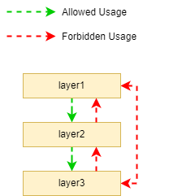

= archunit-experiments
:toc:

== Purpose of this project

This project is to test the behaviour and features of archunit.

== Sample structure

== Outcome

=== Take-Away Notes
* With ArchUnit ...
** ... you cannot prevent that constants referring to Java-primitives or Strings from forbidden packages or layers are used, as ArchUnit currently executes its tests against the bytecode (see Annotated Example below)
** ... you cannot totally prevent a forbidden import instruction to appear in your Java class. Anyhow: Coding against forbidden classes is nearly impossible (see Annotated Example below).

=== Tests
[source, java]
----
include::src/test/java/de/koelle/christian/archunit/ArchUnitTest.java[]
----

=== Annotated Example
[source, java]
----
include::src/main/java/de/koelle/christian/archunit/layer1a/MyLayer1Clazz.java[]
----